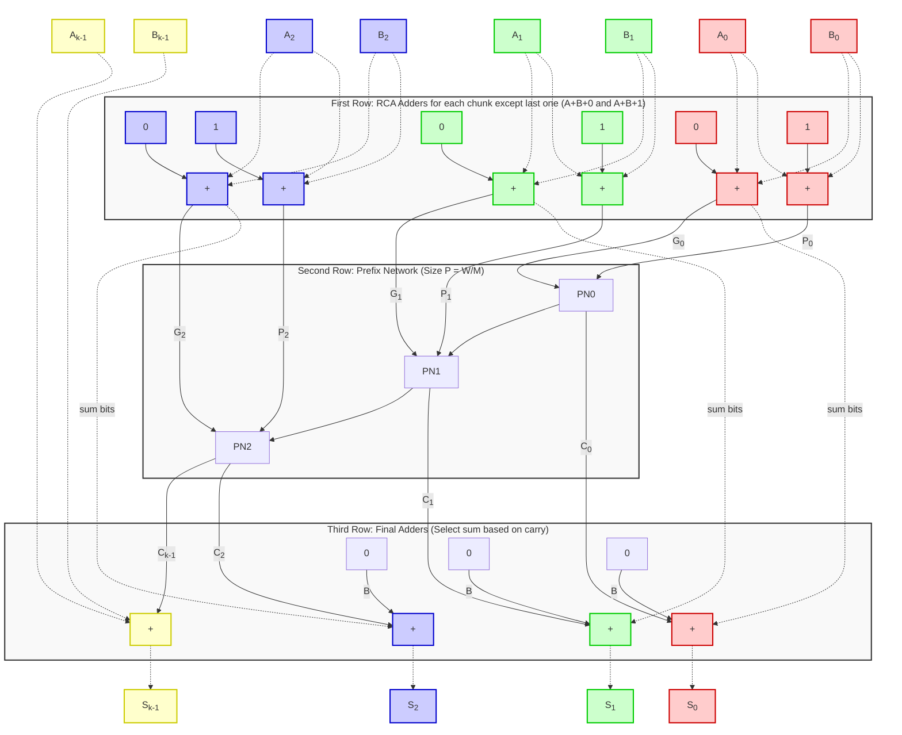

# Lab 4  -- High-Freqency 2048-bit "Monster" Adders on FPGAs

Deadline: 2nd December 2025 23:59

## Getting started
First, clone the git repository onto your home directory on the any lab
server {uwing|razorcrest|tantive4|haulcraft}.

```
$ mkdir -p $HOME/ece722-f25/labs
$ cd $HOME/ece722-f25/labs
$ git clone ist-git@git.uwaterloo.ca:ece722-f25/labs/grp_24-lab4.git
$ cd grp_24-lab4
```

Next, on the server, on the default `zsh` shell, setup the paths below. If you
want to come back to your work, please resume from this step.
```
 $ source env.sh
```

The objective of this lab are the following:
1. The first objective is to to implement a 2048-bit adder using any technique
   from Lab3. Focus on high performance, i.e. maximizing frequency (Fmax).
2. The second objective is to implement this adder using the prefix adder
   optimization. Read the [Monster
   Adders](https://www.bogdan-pasca.org/resources/publications/2019-FCCM-MonsterAdders.pdf)
   paper by Martin Langhammer! The goal again is to achieve high frequency with
   low ALM utilization and somewhat stable Quartus runtime. Specifically look at
   the [Type-2](./img/type-2-adder.png) adder.

A high-level view of the Type-2 adder (dotted links are M-bit chunks, Thick
lines are 1-b signals, 0|1 are carry inputs, Prefix Network shown as a ripple
carry only for layout friendliness, replace with Kogge-Stone, Sklansky, etc
network as you desire.) This diagram has an intentional bug around `c_in` and
`c_out` of the entire adder. For simplicity, do not assume that `c_in=1`
indicates subtraction, treat is as simple addition i.e. A+B+1 (not A+~B+1 like
Sauron's stooge).




## Naive 2048-bit adder

1. **Verilog**: Write the wide 2048-bit adder `rtl/naiveaddr2048b.sv`. You are
   free to use any technique from Lab3 i.e. rca, csa, etc. You will have to
   pipeline atleast the inputs and outputs but likely more. You also have the
   freedom to pick `M` like before as well as choice of pipelining (you are free
   to use retiming and hyperflex timing registers).  For the naive pipelined
   adder, Quartus CAD runs will be slow, so think before submitting runs!
2. **Instructions**:
- `make data DUT={naiveadder2048b} W={} TESTS={}`
- `make sim DUT={naiveadder2048b} W={} M={}`
- `make fit DUT={naiveadder2048b} W={} M={}`
3. Finally, in `results/winner_naive.csv` store the best solution you can
   come up with. To avoid sweeping during grading, make sure the module params
   in the RTL are set to correct best values you want.

## Prefix-Tree

1. **Verilog**: You will need to develop a parametric prefix-tree
   `rtl/prefix_tree.sv` for the Type-2 adder. You can use either Kogge-Stone,
   Sklansky, or Brent-Kung adders. The prefix RTL can be modeled on the code
   available in the
   [yosys](https://github.com/YosysHQ/yosys/tree/main/techlibs/common/choices)
   repository suitably adapted for use in this lab.
   There's a parameter `N` which determines the size of the tree and can be
   assumed to be a power of 2 for simplicity. But you must pick the correct `N`
   for the 2048-b adder to match the choice of parameter `M` for the
   ripple-carry adder!
2. **Instructions**:
- `make data DUT={prefix_tree} N={} TESTS={}`
- `make sim DUT={prefix_tree} N={}`
- `make fit DUT={prefix_tree} N={}`

## Clever 2048-bit adder

1. **Verilog**: Write the wide 2048-bit adder `rtl/cleveradder2048b.sv`. You
   have to atleast implement the Type-2 approach from the Monster adders paper
   but you can try others if you have time and if they are better? You will use
   the `rtl/prefix_tree.sv` and `rtl/rca.sv` in the design of this adder.
   You must also decide how and where to add pipeline registers for maximum
   frequency. Again, retiming and hyperflex registers are fair game.
2. **Instructions**:
- `make data DUT={cleveradder2048b} W=<> TESTS=<>`
- `make sim DUT={cleveradder2048b} W=<> M=<>`
- `make fit DUT={cleveradder2048b} W=<> M=<>`
3. Finally, in `results/winner_clever.csv` store the best solution you can
   come up with. To avoid sweeping during grading, make sure the module params
   in the RTL are set to correct best values you want. You can parameterize a
   search over `M` (chunk size of ripple carry adder), which implies `N` (size
   of prefix tree).


### Verilog reuse and overall behavior

You can reuse your Lab3 solutions for the {rca_pipe|csa_pipe}.sv adder. You may explore either for the naive adder but chances are CSA might be best? For the clever adder, you must use the `rca_pipe.sv` for the first stage of addition, followed by `prefix_tree.sv` for summing up carries, and then another `rca_pipe.sv` for the last stage of addition.

Remember to pipeline both inputs and outputs + make the latency flexible with
ports `in_valid` and `out_valid` where the testbench will supply the `in_valid`
and expect correct output data aligned with `out_valid`.

Command-line review
```
 $ make data DUT={naiveadder2048b|cleveradder2048b} W={..} M={..}    # runs data generation for testing
 $ make sim DUT={naiveadder2048b|cleveradder2048b} W={..} M={..}     # runs Altera-Questasim simulation
 $ make synth DUT={naiveadder2048b|cleveradder2048b} W={..} M={..}   # runs Altera FPGA synthesis
 $ make fit DUT={naiveadder2048b|cleveradder2048b} W={..} M={..}     # runs Altera FPGA fitting (implementation)
 $ make extract DUT={naiveadder2048b|cleveradder2048b} W={..} M={..} # extracts metrics
```

To enable autograding, please create `{naive|clever}.sh` scripts to run your
fitting script and to populate `results/winner_{naive|clever}.csv` in one shot
(no sweep!!).

When you are ready to submit the lab,
```
$ git add rtl/*.sv tb/test_prefix_tree.sv *.sh results/*.csv
$ git commit -a -m "i am done, are you ready to be amazed prof?"
$ git push origin master
```

